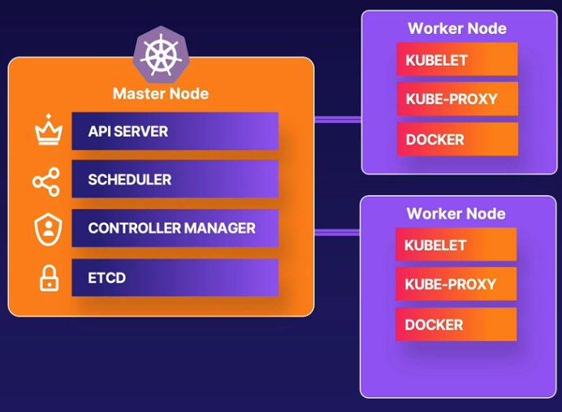

# Kubernetes, etrafındaki terimler ve ilişkileri, kurulumlar

Docker en eski platformlardan olduğu için tıpkı selpak ile peçete ayrımı gibi markanın tüm pazarın adı olduğu bir durumu yaşıyoruz. 
Aralarındaki ilişkileri anlamak için farklarını ortaya koyarak başlayalım.

## Kubernetes ve Docker İlişkisi

#### Docker Nedir?

Bir sanal makine, eksiksiz bir işletim sistemi içerirken, bir konteyner ise üstünde çalıştığı işletim sisteminin çekirdeğine erişir.

Önce etrafınızda dönüp dolaşan terimlerin ilişkilerini öğrenelim.


**Docker**, şirket içinde veya bulutta barınan konteynerleri otomatikleştirmeyi sağlayan, içinde çalışan uygulamalar için işletim sistemini de kapsayan dosya biçimidir. Bu süreci işletmek için docker, bir iş istasyonuna veya sunucuya kurulacak şekilde tasarlanmıştır ve bir geliştirici veya DevOps çalışanı olarak kapsayıcıları oluşturmayı ve çalıştırmayı kolaylaştıran bir dizi araçla birlikte gelir.

Docker komut satırı aracı, konteynerlerin kalıplarını (image) oluşturabilir, bunları kayıtlı oldukları havuzlardan (https://hub.docker.com/ gibi) çekebilir, konteynerleri oluşturabilir, başlatabilir ve yönetebilir.

Tüm bunları yapabilmek için docker aşağıdaki projelerden meydana gelir:
- **docker-cli**: Bu, `docker [run, start, stop, restart, exec, rm, rmi ..] ..` komutlarını kullanarak etkileşim kurduğunuz komut satırı programıdır.
- **containerd**: Bu, konteynerleri yöneten ve çalıştıran bir arka plan programıdır. Yansıları (kalıp, image) havuzlardan çeker (veya basar), depolamayı ve ağ oluşturmayı yönetir ve konteynerlerin çalışmasını denetler. Docker, containerd'ı kendi içinde kullanır. Docker'ı kurduğunuzda, aynı zamanda containerd de kurulacaktır. containerd, cri eklentisi aracılığıyla Kubernetes Container Runtime Interface'i (CRI) uygular. Tam burada Kubernetes içinde CRI-O kullanıldığını belirtelim. 
- **runc**: Bu, düşük seviyeli konteyner çalışma zamanı veya konteynerleri oluşturan, çalıştıran şeydir. Konteynerleri oluşturmak için Go tabanlı uygulama olan libcontainer'ı içerir. runc, konteynerler için *isim alanları* (namespace) ve *denetim grupları* (cgroups) gibi mevcut düşük düzeyli Linux özellikleriyle etkileşime girerek tüm düşük düzeyli işlevleri sağlar. Konteyner içindeki proseslerin oluşturmulması ve çalıştırılması için runc bu özelliklerini kullanır. runc'nin alternatifleri arasında gVisor, crun, kata-runtime bulunurken Windowsta *Microsoft’s Host Compute Service (HCS)* runc'nin görevini görür.

Gerçekte, docker ile bir konteyner çalıştırdığınızda, aslında onu Docker arka plan programı (docker-cli), *containerd* ve ardından *runc* aracılığıyla çalıştırıyorsunuz.

Peki docker konteyneri nasıl işletiyor:


#### Kubernetes Nedir?

**Kubernetes** ise bulutta veya şirket içinde bulunan konteynerleri denetleyip düzenleme imkânı sağlayan yazılımdır.
5 Dakikada öğrenmek için [buraya](https://www.youtube.com/watch?v=fO3vUMc_WbI&t=2s&ab_channel=EyeonTech) tıklayınız. 

Kubernetes, *Container Runtime Interface*'i (**CRI**) destekleyen herhangi bir konteyner çalışma zamanı aracılığıyla konteynerleri çalıştırmayı tercih eder. Ancak Docker, Kubernetes'ten daha eski olduğu için CRI uygulamıyor. Geçmişte, konteyner çalışma zamanları için çok fazla iyi seçenek yoktu ve Kubernetes, Kubernetes ile Docker arasında bir arabirim görevi görecek ek bir katman olan Docker-shim uyguladı. Kubernetes, Docker'ı desteklemesini sağlayan *dockershim* adlı bir bileşen içeriyordu ancak şimdi, CRI'yi uygulayan çok sayıda çalışma zamanı var ve Kubernetes'in Docker için özel desteği sürdürmesi artık mantıklı değil. ([Shim nedir?](https://www.youtube.com/watch?v=3jDzSbPEmJM&ab_channel=AcoemUSA))

Bundan sonra Kubernetes, Docker desteğini doğrudan kaldıracak ve yalnızca Container Runtime Interface'i uygulayan konteyner çalışma zamanlarını kullanmayı tercih edecek. Bu muhtemelen *containerd* veya *CRI-O* kullanılacak anlamına gelir.

Ancak bu, Kubernetes'in Docker biçimli kapsayıcıları çalıştıramayacağı anlamına gelmez. Hem containerd hem de CRI-O, Docker formatlı (aslında OCI formatlı) yansıları (image) çalıştırabilir, sadece docker komutunu veya Docker arka planını kullanmak zorunda kalmadan yaparlar.

Aslında Docker, konteynerleri doğrudan çalıştırmayıp, arka planda containerd'yi konteyner çalışma zamanı olarak kullanır. Böylece Docker, üzerinde kullanıcı tarafından erişilebilen ve zengin özelliklere sahip bir arayüz sunar. Kubernetes için konteyner çalışma zamanı olarak kullanıldığında Docker, Kubernetes ve konteyner arasında yalnızca bir aracıdır. Ancak Kubernetes, containerd'i doğrudan bir konteyner çalışma zamanı olarak kullanabilir, yani bu aracı rolünde Docker'a artık ihtiyaç duyulmaz! ([*](https://acloudguru.com/blog/engineering/kubernetes-is-deprecating-docker-what-you-need-to-know))

#### Container Runtime Interface (CRI) Nedir?


CRI, kullanmak isteyebileceğiniz her tür konteyner çalışma zamanı için bir soyutlamadır. 

Kubernetes, Container Runtime Interface (CRI) olarak bilinen bir standardı uygulayan tüm kapsayıcı çalışma zamanlarıyla çalışır. Bu, esasen Kubernetes ile konteyner çalışma zamanı arasında standart bir iletişim yöntemidir ve CRI standardıno/protokolünü destekleyen herhangi bir çalışma zamanı, Kubernetes ile otomatik olarak çalışır.

#### Peki OCI (Open Container Initiative) Nedir?

OCI, CRI standartını ortaya koyan bir konsorsiyumdur. Başka bir deyişle OCI, konteyner yansı formatı ve konteynerlerin nasıl çalıştırılması gerektiği için bir standart/protokol sağlayan bir grup teknoloji şirketidir. 

OCI'nin arkasındaki fikir, standarda/protokle/şartnameye uyan farklı çalışma zamanları arasında seçim yapabilmenizdir. Bu çalışma zamanlarının her biri farklı alt düzey uygulamalara (örn. runc) sahiptir. Örneğin, Linux ana bilgisayarlarınız için bir OCI uyumlu çalışma zamanınız ve Windows ana bilgisayarlarınız için bir çalışma zamanınız olabilir. Bu, birçok farklı proje tarafından uygulanabilecek tek bir standarda sahip olmanın avantajıdır. Bu aynı "tek standart, birçok uygulama" yaklaşımı, Bluetooth cihazlarından Java API'lerine kadar her yerde kullanılmaktadır.

#### Konteyner Çalışma Zamanı (container runtime)


Konteyner çalışma zamanı, konteynerleri yaratama, çalıştırma ve yok etme işlerini yapan işlemdir ve **containerd**, bir *konteyner çalışma zamanı* (container runtime) örneğidir. 

Kubernetes, bir kapsayıcı çalışma zamanı olarak Docker desteğini kaldırıyor. Kubernetes aslında kapsayıcıları bir makinede çalıştırma işlemini gerçekleştirmez. Bunun yerine, kapsayıcı çalışma zamanı adı verilen başka bir yazılım parçasına dayanır.

Dolayısıyla, konteynerlerinizi çalıştırmak için containerd veya CRI-O kullanmayı tercih ederseniz, yapabilirsiniz. Bunun nedeni, bu çalışma zamanlarının her ikisinin de CRI belirtimini uygulamasıdır. Farklı CRI uygulamaları arasında ince farklar vardır, ancak bunların takılabilir ve sorunsuz bir şekilde değiştirilebilir olması amaçlanmıştır. Bir satıcıdan destek satın alıyorsanız (güvenlik, hata düzeltmeleri vb.), çalışma zamanı seçiminiz önemli olabilir. Örneğin, Red Hat'in OpenShift'i CRI-O kullanır ve bunun için destek sunar. Docker kendi kapsayıcıları için destek sağlar.

##### Kubernetes'te konteyner çalışma zamanınızı nasıl kontrol edebilirsiniz?

Kubernetes mimarisinde, kubelet (her düğümde çalışan aracı), konteynerleri başlatmak ve çalıştırmak için konteyner çalışma zamanına yönergeler göndermekten sorumludur. Her düğümdeki kubelet parametrelerine bakarak hangi konteyner çalışma zamanını kullandığınızı kontrol edebilirsiniz. Hangi çalışma zamanının kullanılacağını yapılandırmak için kullanılan `--container-runtime` ve `--container-runtime-endpoint` seçenekleri vardır.


```shell
kubectl get nodes -o wide
```

Çıktı içinde:

```shell
CONTAINER-RUNTIME
docker://20.10.17
```

Kaynak: 
- https://kubernetes.io/docs/tasks/administer-cluster/migrating-from-dockershim/find-out-runtime-you-use/

# Kubernetes Kuralım

Kendi yönettiğiniz bir küme için Kubernetes'i resmi olarak desteklenen araç [kubeadm](https://kubernetes.io/docs/setup/production-environment/tools/kubeadm/) ile kurabilirsiniz.
Ayrıca AWS üstünde kurulum yapabilmek için kops veya kubeadm'e alternatif olarak tüm bulut hizmetlerine kubespray kullanarak kurulum yapabilirsiniz. Ayrıntı için [bu adresten](https://kubernetes.io/docs/setup/production-environment/tools/) faydalanabilirsiniz.

## Kubernetes 1.24 Sürümünü kubeadm ile Ubuntu Üstünde Kuralım 


containerd'nin çalıştırılabilmesi için bilgisayar her başlatıldığında overlay ve br_netfilter kernel modüllerini yüklenmesi gerekiyor.

NOT (SELINUX için): 
- Küme iletişimi için br_netfilter modülünü etkinleştirmeyi `modprobe br_netfilter` ile yaparız. 
- `bridge-nf-call-iptables` değerine 1 veriyoruz. Böylece Kubernetes, IP Tables'ın kurallarını değiştirerek DNS ile Service Discovery yapabilir.
echo '1' > /proc/sys/net/bridge/bridge-nf-call-iptables
```

Bunu tüm node'lar üstünde yapacağız (master node yerine "control plane", diğer k8s düğümleri için "worker node" deniliyor)

Buna göre /etc/modules-load.d dizinindeki conf dosyalarında belirtilen modüllerin kernel tarafından sistem başlatılırken yüklenmesi istenmiş olur. Bu modüllerin yüklenmesini sistemin tekrar başlatılmasına bırakmamak için aşağıdaki komutunu çalıştıralım:

```shell
$ modprobe <modül_adı>
```


Şimdi sistem seviyesi ayarlarını yapacağız ve k8s ağ yapılandırması için `/etc/sysctl.d/` dizininde `99-kubernetes-cri.conf` isimli conf dosyasını oluşturacağız:

```shell
$ cat <<EOF | sudo tee /etc/sysctl.d/99-kubernetes-cri.conf
net.bridge.bridge-nf-call-iptables = 1
net.ipv4.ip_forward = 1
net.bridge.bridge-nf-call-ip6tables = 1
EOF
```

Bu ayarlar da sistem tekrar başladığında faal olacaktır ama derhal faal edebilmek için aşağıdaki komutu çalıştırı ve dosyanın okunması sağlanır.

```shell
$ sudo sysctl --system
```


### containerd Kurulumu ve Ayarlarının Yapılması

Artık containerd paletinin kurulması için `apt-get update` ve `apt-get install -y containerd` komutlarını çalıştırabiliriz.
containerd'nin ayarlarının olacağı dizini `$ mkdir -p /etc/containerd` komutuyla oluşturuyoruz
containerd Uygulaması varsayılan ayarlarını görüntülesin diye aşağıdaki komutu çalıştırıyoruz:
```shell
$ sudo containerd config default
```


Bu ayarların `config.toml` dosyası oluşturularak saklanması için tee ile çıktıyı dosyaya yönlendiriyoruz

```shell
$ sudo containerd config default | sudo tee /etc/containerd/config.toml
```

Artık containerd ayar dosyasıyla hazır ve servis olarak başlatıp durumunu görebiliriz:
```
$ sudo systemctl restart containerd
$ sudo systemctl status containerd
```


### Kubernetes Paketlerini Kurmak

> Takas alanı (swap), sabit disk üzerinde işletim sistemi tarafından ayrılmış bir bölümdür. İşlenecek veriler RAM'e sığmadığı zaman bu bölüm RAM gibi kullanılır ve böylece işlemlerin devam etmesi sağlanır. Sabit disklerin veri okuma/yazma hızları RAM'lerden çok daha düşük olduğu için takas alanının kullanılması işlemleri yavaşlatır.

K8s swap'ın kapatılmasını istediği için `sudo swapoff -a` komutuyla takas alanını kapatıyoruz.

Kubernetes öncesinde kurulumda kullanacağımız bazı paketleri kuralım:

```shell
$ sudo apt-get update && sudo apt-get install -y apt-transport-https curl
```

Kubernetes paketlerini indireceğimiz reponun GPG anahtarını çekelim:

```shell
$ curl -s https://packages.cloud.google.com/apt/doc/apt-key.gpg | sudo apt-key add -
```

Kubernetes paketlerini indireceğimiz paket havuzunun adresini kubernetes.list dosyasını oluşturarak yazalım:

```shell
$ cat <<EOF | sudo tee /etc/apt/sources.list.d/kubernetes.list
deb https://apt.kubernetes.io/ kubernetes-xenial main
EOF
```

Google paket havuzundaki paketlerin listesini bilgisayarımıza çekelim:

```shell
$ sudo apt-get update
```

Ve sıra Kubernetes paketlerini yüklemeye geldi (**kubelet**, **kubeadm**, **kubectl**):

```shell
$ sudo apt-get install -y kubelet=1.24.0-00 kubeadm=1.24.0-00 kubectl=1.24.0-00
```

Bu paketlerin otomatik güncellenmeyeceğinden emin olmak için "hold" durumuna çekelim:

```shell
$ sudo apt-mark hold kubelet kubeadm kubectl
```


# Kubernetes Kümesini Oluşturmak


Bir k8s kümesinde master (control plane) adı verdiğimiz yönetici düğüm ve POD'ları ayaklandıran düğümler (node) olur.


## Kubernetes Bileşenleri



Bir kümede master ve POD'ların çalıştığı düğümler bulunurlar. Ana düğümde tüm k8s elemanları bulunurken diğer düğümlerde sadece 3 bileşen bulunur.

Kontrol Düzlemi (master) elemanları:
- kube-apiserver
- kube-controller-manager
- kube-scheduler
- addons
- etcd
- kubectl : kümenizle konuşmak için komut satırı aracı

Düğümlerde ise:
- kubelet : kümenizdeki tüm makinelerde çalışan ve POD ve KONTEYNER'leri başlatmak gibi işleri yapan bileşen.
- kube-proxy
- dockers

Ana düğümü kurmak için kubernetes ve etcd ile kuruyorken (`yum install -y kubernetes etcd`), işçi düğümü sadece kubernetes ile kurarız (`yum install -y kubernetes`).


### Kubernetes içindeki parçalar 

#### Master Node Elemanları:
- ***kube-apserver:*** Kubernetes API'sini ortaya çıkarır 
- ***etcd:*** Kümenizin durumunu açıklayan Kubernetes nesnelerinin dayanıklı, tutarlı, kalıcı depolanması 
- ***kube-controller-manager:*** Düğümlerin ne zaman düştüğünü algılamak gibi rutin küme görevlerinden sorumlu denetleyicileri çalıştırır 
- ***kube-scheduler:*** Kaynak gereksinimlerine ve diğer kısıtlamalara göre bölmelerin atanacağı çalışan düğümleri seçer. Bölmeler mantıksal olarak gruplandırılmış kaplardır. 
- ***addons:*** DNS ve kullanıcı arayüzü gibi ek küme özellikleri sağlayın

#### Worker Node Elemanları:
- **kubelet**: Pod'ların çalıştırılması, durumlarının raporlanması gibi görevlerden sorumlu birincil ajan olarak k8 düğümünde yer alır.
- **kube-proxy**: Ağ kurallarını ve bağlantı yönlendirmeyi sağlayarak Kubernetes hizmet soyutlamasını etkinleştirir
- **Dockers**: Konteynerlerin çalıştırılmasını sağlar

### Kullanıcı & Servis Hesapları
**apiserver**'a API isteklerini bir hesap bilgisiyle yaparız ve bu hesapları (User/Service account) yetkilendirmek için "**admission controller**" çalışır.
**USER ACCOUNT**: Kubernetes cluster'ına bir işlem yaptırmak için kullanıcı olarak "**biz**" kubectl ile komut çalıştırırız.
apiserver tarafına gelen bu istekler için kullanıcı hesabımız ile yetkilendiriliriz. 

**SERVICE ACCOUNT**: POD'ların konteynerlerinde çalışan uygulamalar da APISERVER'a erişmek isteidğinde bu kez hizmet hesabı (örneğin default) yetkilendirilir.
Bu amaçla otomatik olarak `default` adlı bir hizmet hesabı oluşturulur. Aşağıda oluşturacağımız anahtar, `default` hizmet hesabının isteklerini yetkilendirmek için kullanılacaktır.


Sanal POD ağımızda kullanılması için (`--pod-network-cidr`) bir IP aralığını CIDR (`192.168.0.0/16`) türünde veriyoruz. Daha sonra kuracağımız CALICO ağ eklentisinin bu ağ tanımına ihtiyacı olacak. Ve kubernetes sürümümüzün versiyon bilgisini `--kubernetes-version 1.24.0` ile veriyoruz.

```shell
sudo kubeadm init --pod-network-cidr 192.168.0.0/16 --kubernetes-version 1.24.0
```


Kurulumun sonunda bize gösterdiği yönergeyi takip edeceğiz:


```shell
mkdir -p $HOME/.kube
sudo cp -i /etc/kubernetes/admin.conf $HOME/.kube/config
sudo chown $(id -u):$(id -g) $HOME/.kube/config
```

Artık kubernetes düğümlerimizi görebiliriz:


Durumunun "**NotReady**" olarak işaretlendiğine dikkat edelim. Henüz ağ eklentisini yüklemediğimiz için (burada CALICO olacak) durumu "**Hazır Değil**" olarak gösteriliyor.

## CNI (Container Network Interface)

Container Network Interface (CNI), ağ kaynaklarını dinamik olarak yapılandırmak için bir çerçevedir. Go'da yazılmış bir grup kitaplık ve şartname kullanır. Eklenti şartnamesi, ağı yapılandırmak, IP adreslerini sağlamak ve birden çok ana bilgisayarla bağlantıyı sürdürmek için bir arabirim tanımlar.

#### Flannel
CoreOS tarafından geliştirilmiştir. Konteynerler arası ve host ile iletişim için tasarlanmıştır. Flannel, katman 3 IPv4 overlay ağını yapılandırır.

#### Calico
Calico, konteynerler, sanal makineler ve yerel ana bilgisayar tabanlı iş yükleri için açık kaynaklı bir ağ ve ağ güvenliği çözümüdür. Calico, Kubernetes, OpenShift, Mirantis Kubernetes Engine (MKE), OpenStack ve yalın donanım hizmetleri dahil olmak üzere çok çeşitli platformları destekler.Calico iyi performansı, esnekliği ve gücü ile bilinir. Kubernetes kümesinde, Calico tek bir dosya ile hızla dağıtılabilir. 
Calico ile standart hata ayıklama araçları, basit ortamlardaki aynı bilgilere erişebilir ve bu sayede daha fazla sayıda geliştiricinin ve yöneticinin durumu anlamasını kolaylaştırır.

#### Canal
Flannel ve Calico’nun bir kombinasyonu olduğu için, faydaları da bu iki teknolojinin kesiştiği noktadadır. Ağ katmanı, fazla ek yapılandırma olmadan birçok farklı dağıtım ortamında çalışan Flannel tarafından sağlanan basit bir yapıdadır. Ağ politikası yetenekleri, üst ağa en üst düzeyde güvenlik ve kontrol sağlamak için Calico’nun güçlü ağ kuralı değerlendirmesiyle birlikte daha güçlü bir seçenek sunar.

#### Weave Net
Weave kümedeki düğümlerin her biri arasında mesh overlay ağı oluşturur ve böylece katılımcılar arasında esnek bir yönlendirme sağlar. Ağını oluşturmak için, Weave ağdaki her ana bilgisayara yüklenen bir yönlendirme bileşenini kullanır. Bu yönlendiriciler daha sonra mevcut ağ ortamının güncel bir görünümünü korumak için topoloji bilgilerini paylaşır. Calico gibi Weave de kümeniz için ağ politikası yetenekleri sağlar. Weave’i kurduğunuzda bu otomatik olarak kurulur ve yapılandırılır.


### Flannel Ağ Eklentisini Yüklemek

Master ve worker düğümlerin hepsinde iptables köprü çağrılarını açın:

```shell
echo "net.bridge.bridge-nf-call-iptables=1" | sudo tee -a /etc/sysctl.conf
sudo sysctl -p
```

Yalnızca Kubernetes ana düğümünde Flannel'i yükleyin:
```shell
kubectl apply -f https://raw.githubusercontent.com/coreos/flannel/bc79dd1505b0c8681ece4de4c0d86c5cd2643275/Documentation/kube-flannel.yml
```


### CALICO Ağ Eklentisini Yüklemek

Aşağıdaki komutu çalıştırdıktan birkaç dakika sonra tekrar k8s düğümlerini listelediğimizde (CALICO'nun aktif olması birkaç dakika alabilir) durumun değiştiğini göreceğiz:

```shell
kubectl apply -f https://docs.projectcalico.org/manifests/calico.yaml
```


Yüklü olan CNI türünü görmek için `kubectl get pods -n kube-system` komutunu çalıştırıyoruz:
```shell
cloud_user@k8s-control:~$ kubectl get pods -n kube-system
NAME                                       READY   STATUS    RESTARTS        AGE
calico-kube-controllers-555bc4b957-k48sx   1/1     Running   0               51s  << 
calico-node-9hvnv                          1/1     Running   0               51s  <<
calico-node-f59w4                          1/1     Running   0               51s  <<
coredns-6d4b75cb6d-fgxsx                   1/1     Running   0               18m
coredns-6d4b75cb6d-sdgt9                   1/1     Running   0               18m
etcd-k8s-control                           1/1     Running   0               19m
kube-apiserver-k8s-control                 1/1     Running   0               19m
kube-controller-manager-k8s-control        1/1     Running   0               19m
kube-proxy-9xj4m                           1/1     Running   0               18m
kube-proxy-v5zp7                           1/1     Running   0               9m41s
kube-scheduler-k8s-control                 1/1     Running   0               19m
```


### Weave Net Ağ Eklentisini Yüklemek

```shell
kubectl apply -f "https://cloud.weave.works/k8s/net?k8s-version=$(kubectl version | base64 | tr -d '\n')"
```

Kurulumu MASTER düğüme yapıyoruz ve CNI yüklenmeden önce hem MASTER hem WORKER düğümlerin "Not Ready" olan durumları kurulum sonrası "Ready" oluyor.

```shell
cloud_user@k8s-control:~$ kubectl get nodes -o wide
NAME          STATUS     ROLES           AGE   VERSION   INTERNAL-IP   EXTERNAL-IP   OS-IMAGE             KERNEL-VERSION    CONTAINER-RUNTIME
k8s-control   NotReady   control-plane   10m   v1.24.0   10.0.1.101    <none>        Ubuntu 20.04.3 LTS   5.11.0-1028-aws   containerd://1.5.9
k8s-worker1   NotReady   <none>          68s   v1.24.0   10.0.1.102    <none>        Ubuntu 20.04.3 LTS   5.11.0-1028-aws   containerd://1.5.9
cloud_user@k8s-control:~$
cloud_user@k8s-control:~$ kubectl apply -f "https://cloud.weave.works/k8s/net?k8s-version=$(kubectl version | base64 | tr -d '\n')"
WARNING: This version information is deprecated and will be replaced with the output from kubectl version --short.  Use --output=yaml|json to get the full version.
serviceaccount/weave-net created
clusterrole.rbac.authorization.k8s.io/weave-net created
clusterrolebinding.rbac.authorization.k8s.io/weave-net created
role.rbac.authorization.k8s.io/weave-net created
rolebinding.rbac.authorization.k8s.io/weave-net created
daemonset.apps/weave-net created
cloud_user@k8s-control:~$
cloud_user@k8s-control:~$ kubectl get nodes -o wide
NAME          STATUS   ROLES           AGE     VERSION   INTERNAL-IP   EXTERNAL-IP   OS-IMAGE             KERNEL-VERSION    CONTAINER-RUNTIME
k8s-control   Ready    control-plane   11m     v1.24.0   10.0.1.101    <none>        Ubuntu 20.04.3 LTS   5.11.0-1028-aws   containerd://1.5.9
k8s-worker1   Ready    <none>          2m18s   v1.24.0   10.0.1.102    <none>        Ubuntu 20.04.3 LTS   5.11.0-1028-aws   containerd://1.5.9
cloud_user@k8s-control:~$
```

Yüklü olan CNI türünü görmek için `kubectl get pods -n kube-system` komutunu çalıştırıyoruz:

```shell
cloud_user@k8s-control:~$ kubectl get pods -n kube-system
NAME                                  READY   STATUS    RESTARTS      AGE
coredns-6d4b75cb6d-fgxsx              1/1     Running   0             12m
coredns-6d4b75cb6d-sdgt9              1/1     Running   0             12m
etcd-k8s-control                      1/1     Running   0             12m
kube-apiserver-k8s-control            1/1     Running   0             12m
kube-controller-manager-k8s-control   1/1     Running   0             12m
kube-proxy-9xj4m                      1/1     Running   0             12m
kube-proxy-v5zp7                      1/1     Running   0             3m11s
kube-scheduler-k8s-control            1/1     Running   0             12m
weave-net-przxj                       2/2     Running   1 (86s ago)   96s    <<
weave-net-wh4k4                       2/2     Running   1 (86s ago)   96s    <<
```


## Worker Düğümleri Kubernetes Kümesine Eklemek

Kontrol düzelmindeki master bize kubeadm komutunu kullanarak bir token verecek ve bunu işçi düğümlerine girerek kümeye dahil edeceğiz.

```shell
kubeadm token create --print-join-command
```


Artık tüm işçi düğümler için bu komutu girerek kubernetes kümesine eklemiş olacağız (bunun için sudo kullanmamız gerekecektir):

```shell
sudo kubeadm join ...
```

İlk Düğüm:


İkinci Düğüm:


İşçi arıları kovana aldıktan sonra tekrar düğümlerin durumlarına bakabiliriz:

```shell
kubectl get nodes
```

Kümeye katılım o anda olmayabilir nitekim "Not Ready" ve "Ready" durumundaki düğümleri ilk ekran görüntüsünde görebiliyorken, bir süre sonra her üç düğümün hazır olduğunu görebileceğiz.


## Tüm komutların listesi

```shell
# containerd için ayar dosyasının oluşturmak ve her sistem başlatıldığında kernelin yükleyeceği modülleri belirtmek:
cat <<EOF | sudo tee /etc/modules-load.d/containerd.conf
overlay
br_netfilter
EOF

# Modülleri yüklemek:
sudo modprobe overlay
sudo modprobe br_netfilter

# Kubernetes ağları için sistem ayarlarını yapmak:
cat <<EOF | sudo tee /etc/sysctl.d/99-kubernetes-cri.conf
net.bridge.bridge-nf-call-iptables = 1
net.ipv4.ip_forward = 1
net.bridge.bridge-nf-call-ip6tables = 1
EOF

# Son ayarlarla sistemi tekrar yüklü olarak çalıştırmak:
sudo sysctl --system

# containerd Kurmak:
sudo apt-get update && sudo apt-get install -y containerd

# ontainerd'nin varsayılan ayarlarını tutan dosya için dizini oluşturmak:
sudo mkdir -p /etc/containerd

# containerd Ayar dosyasını varsayılan değerlerle oluşturmak:
sudo containerd config default | sudo tee /etc/containerd/config.toml

# containerd Tekrar başlatılarak ayarların etkin olduğundan emin olmak:
sudo systemctl restart containerd

# containerd'nin çalıştığından emin olmak:
sudo systemctl status containerd

# swap Özelliğini kapatmak:
sudo swapoff -a

# İhtiyacımız olacak diğer paketleri kurmak:
sudo apt-get update && sudo apt-get install -y apt-transport-https curl

# Google'dan paketleri çekeceğimiz havuzun GPG anahtarını indirmek ve sisteme eklemek:
curl -s https://packages.cloud.google.com/apt/doc/apt-key.gpg | sudo apt-key add -

# Kubernetes'i paket havuzları listesine eklemek:
cat <<EOF | sudo tee /etc/apt/sources.list.d/kubernetes.list
deb https://apt.kubernetes.io/ kubernetes-xenial main
EOF

# Paket listesini güncellemek:
sudo apt-get update

# Kubernetespaketlerini indirmek(Not: Eğer dpkg lock mesajı alırsanız, 1-2 dakika bekleyip tekrar komutu çalıştırın):
sudo apt-get install -y kubelet=1.24.0-00 kubeadm=1.24.0-00 kubectl=1.24.0-00

# Otomatik güncellemeleri kapatın:
sudo apt-mark hold kubelet kubeadm kubectl

# !!!! Buraya kadar CONTROL-DATA plane aynı idi ancak buradan sonra önce MASTER sonra WORKER düğümler için yapılandırmaya devam edeceğiz
```

```shell
# !!!! MASTER node komutları !!!!

# CLUSTER içinde ağ bilgilerini tanımlayalım
sudo kubeadm init --pod-network-cidr 192.168.0.0/16 --kubernetes-version 1.24.0

# kubectl komutlarını her çalıştırdığımızda hedef control plane sunucusu (master node) bilgilerini .kube/config dizinine tanımlayacağız
# Eğer root kullanıcısı ile kubectl komutları çalıştırıyorsak /etc/kubernetes/admin.conf dosyasındaki ayarları kullanabiliriz
mkdir -p $HOME/.kube
sudo cp -i /etc/kubernetes/admin.conf $HOME/.kube/config
sudo chown $(id -u):$(id -g) $HOME/.kube/config

# kubectl komutlarını çalıştırabileceğimize göre CNI için CALICO'yu yükleyebiliriz
kubectl apply -f https://docs.projectcalico.org/manifests/calico.yaml

# Artık varsa İŞÇİ DÜĞÜMLERİ (worker node - data plane) control plane ile tanıştırıp k8s kümesine ekleyelim
# Önce token içeren komutu master node üstünde yaratıp, worker node üstünde çalıştıralım 
kubeadm token create --print-join-command
```

```shell
# !!!! WORKER node komutları !!!!
# !!!! Yukarıda üretilen TOKEN içeren kodu WORKER NODE üstünde çalıştıracağız !!!!
sudo kubeadm join ...
```

```shell
# MASTER NODE üstünde diğer WORKER NODE tanımlarının eklenip eklenmediğini göstere Status bilgisini görelim
kubectl get nodes
```