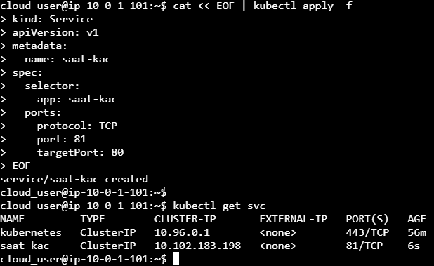

# Yüksek Erişilebilirlik için Servis Oluşturmak

## Göreviniz

- nginxdemos/hello:plain-text Yansısında 4 Kopya POD yaratılacak
- Bu POD'ları işaret eden bir servis yaratılacak (POD'ların 80 portuna ulaşmalı)
- radial/busyboxplus:curl yansısından bir POD oluşturup her defasında farklı POD'a istek geldiğini göreceğiz

## ÇÖZÜM

### Deployment ile 4 kopya olacak şekilde POD'ları oluşturalım

```shell
cat << EOF | kubectl apply -f -
apiVersion: apps/v1
kind: Deployment
metadata:
  name: saat-kac
  labels:
    app: saat-kac
spec:
  replicas: 4
  selector:
    matchLabels:
      app: saat-kac
  template:
    metadata:
      labels:
        app: saat-kac
    spec:
      containers:
      - name: saat-kac
        image: nginxdemos/hello:plain-text
        ports:
        - containerPort: 80
EOF
```

```shell
cloud_user@ip-10-0-1-101:~$ cat << EOF | kubectl apply -f -
> apiVersion: apps/v1
> kind: Deployment
> metadata:
>   name: saat-kac
>   labels:
>     app: saat-kac
> spec:
>   replicas: 4
>   selector:
>     matchLabels:
>       app: saat-kac
>   template:
>     metadata:
>       labels:
>         app: saat-kac
>     spec:
>       containers:
>       - name: saat-kac
>         image: nginxdemos/hello:plain-text
>         ports:
>         - containerPort: 80
> EOF
deployment.apps/saat-kac created
cloud_user@ip-10-0-1-101:~$
cloud_user@ip-10-0-1-101:~$ kubectl get deployment
NAME       DESIRED   CURRENT   UP-TO-DATE   AVAILABLE   AGE
saat-kac   4         4         4            4           10s
cloud_user@ip-10-0-1-101:~$
cloud_user@ip-10-0-1-101:~$ kubectl get pods
NAME                        READY   STATUS    RESTARTS   AGE
busybox                     1/1     Running   0          53m
saat-kac-6c8b7b67c4-6dgsf   1/1     Running   0          17s
saat-kac-6c8b7b67c4-mzf87   1/1     Running   0          17s
saat-kac-6c8b7b67c4-shqsz   1/1     Running   0          17s
saat-kac-6c8b7b67c4-wj2ks   1/1     Running   0          17s
```

### Servis yaratıp POD'ları altına alalım

```shell
cat << EOF | kubectl apply -f -
kind: Service
apiVersion: v1
metadata:
  name: saat-kac
spec:
  selector:
    app: saat-kac
  ports:
  - protocol: TCP
    port: 81
    targetPort: 80
EOF
```



```shell
cloud_user@ip-10-0-1-101:~$ cat << EOF | kubectl apply -f -
> kind: Service
> apiVersion: v1
> metadata:
>   name: saat-kac
> spec:
>   selector:
>     app: saat-kac
>   ports:
>   - protocol: TCP
>     port: 81
>     targetPort: 80
> EOF
service/saat-kac created
cloud_user@ip-10-0-1-101:~$
cloud_user@ip-10-0-1-101:~$ kubectl get svc
NAME         TYPE        CLUSTER-IP       EXTERNAL-IP   PORT(S)   AGE
kubernetes   ClusterIP   10.96.0.1        <none>        443/TCP   56m
saat-kac     ClusterIP   10.102.183.198   <none>        81/TCP    6s
```

### Sayfanın geldiğini görmek için busybox POD'unu yaratalım

Yansı adı: `radial/busyboxplus:curl`
Hemen kapanmasın diye 5400sn bekletiyoruz: `command: ["sleep", "5400"]`

```shell
cat << EOF | k apply -f -
apiVersion: v1
kind: Pod
metadata:
  name: busybox-curl-denetci-pod
  labels:
    name: busybox-curl-denetci-pod
spec:
  containers:
  - image: radial/busyboxplus:curl
    command: ["sleep", "5400"]
    name: ccc
EOF
```

Farklı pod'lara isteklerin düştüğünü görmek için yarım saniye aralıklarla `watch -n 0.5 -x kubectl exec busybox-curl-denetci-pod -- curl -s saat-kac:81` kodunu çağırıyoruz: 


### Kaynaklar
- https://williamqliu.github.io/2019/12/10/kubernetes-by-doing.html