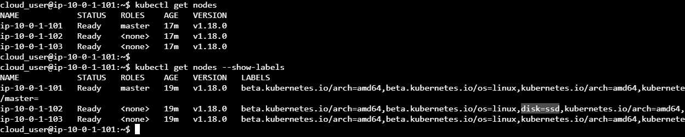
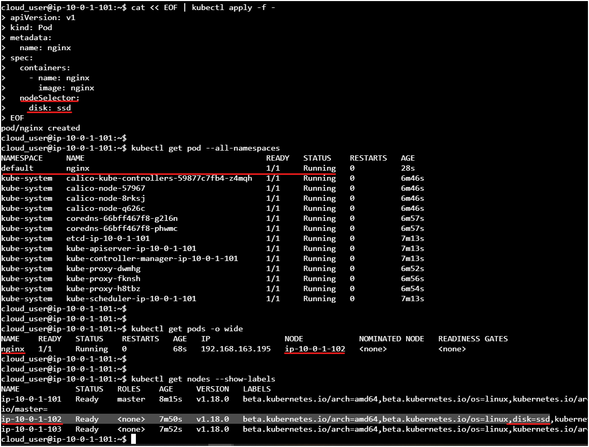

# Düğümlerin Etiketlerine Uygun POD Çalıştırma

## Göreviniz
- Tüm düğümleri listeleyin
- Tüm düğüm etiketlerini getirin
- Pod YAML dosyasını disk=ssd etiketli düğümde çalışacak şekilde oluşturun
- POD'u ayaklandırdığınızda doğru düğümde çalıştığını doğrulayın

## ÇÖZÜM

### Tüm düğümleri listeleyin

Önce k8s kümesindeki tüm düğümleri listelyelim:

```shell
kubectl get nodes 
```


Aşağıdaki çıktıya göre 1 master 2 worker düğümümüz var. Acaba hangisi disk=ssd etiketiyle etiketlenmiş? 

```shell
cloud_user@ip-10-0-1-101:~$ kubectl get nodes
NAME            STATUS   ROLES    AGE   VERSION
ip-10-0-1-101   Ready    master   17m   v1.18.0
ip-10-0-1-102   Ready    <none>   17m   v1.18.0
ip-10-0-1-103   Ready    <none>   17m   v1.18.0
cloud_user@ip-10-0-1-101:~$
```

### Tüm düğümleri etiketleriyle getirin

Düğümleri etiketlerini gösterecek (`--show-labels`) şekilde listeleyelim:

```shell
kubectl get nodes --show-labels
```


```shell
cloud_user@ip-10-0-1-101:~$ kubectl get nodes --show-labels
NAME            STATUS   ROLES    AGE   VERSION   LABELS
ip-10-0-1-101   Ready    master   19m   v1.18.0   beta.kubernetes.io/arch=amd64,beta.kubernetes.io/os=linux,kubernetes.io/arch=amd64,kubernetes.io/hostname=ip-10-0-1-101,kubernetes.io/os=linux,node-role.kubernetes.io
/master=
ip-10-0-1-102   Ready    <none>   19m   v1.18.0   beta.kubernetes.io/arch=amd64,beta.kubernetes.io/os=linux,disk=ssd,kubernetes.io/arch=amd64,kubernetes.io/hostname=ip-10-0-1-102,kubernetes.io/os=linux
ip-10-0-1-103   Ready    <none>   19m   v1.18.0   beta.kubernetes.io/arch=amd64,beta.kubernetes.io/os=linux,kubernetes.io/arch=amd64,kubernetes.io/hostname=ip-10-0-1-103,kubernetes.io/os=linux
```




### Pod YAML dosyasını disk=ssd etiketli düğümde çalışacak şekilde oluşturun

POD'u oluştururken nodeSelector özelliğine etiketin adını ve değerini yazmamız yeterli olacaktır.

```shell
cat << EOF | kubetctl apply -f -
apiVersion: v1
kind: Pod
metadata:
  name: nginx
spec:
  containers:
    - name: nginx
      image: nginx
  nodeSelector:
    disk: ssd
EOF
```



### POD'u ayaklandırdığınızda doğru düğümde çalıştığını doğrulayın

