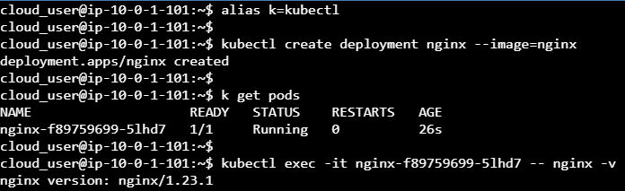

Bu uygulamalı laboratuvarda size üç düğümlü bir küme sunulacaktır. Bu dağıtımdan bir hizmet oluşturmanız gereken basit bir nginx dağıtımı oluşturacaksınız. Bunu başarmak için, dağıtımı oluşturmak için kubectl komut satırını kullanacaksınız. Ardından, hizmeti oluşturmak için dağıtımı kullanıma sunacaksınız. Hizmetin çalışır durumda olduğunu doğruladığınızda, bu hizmetin DNS çözümlemesini test etmek için bir meşgul kutusu bölmesi oluşturacaksınız.


### Docker yüklemek

Docker gpg anahtarlarını alın ve deponuza ekleyin.

```shell
curl -fsSL https://download.docker.com/linux/ubuntu/gpg | sudo apt-key add -
```

Paket havuzunu sisteminizdeki havuzların arasına katıp, paketlerin listesini güncelleyelim:
```shell
sudo add-apt-repository "deb [arch=amd64] https://download.docker.com/linux/ubuntu $(lsb_release -cs) stable"
sudo apt update
```

```shell
sudo apt install -y docker-ce=5:19.03.10~3-0~ubuntu-focal
```

### Kubernetes (1.18.5) yüklemek

Kubernetes'in anahtar çiftlerini sistemimize indirelim:

```shell
curl -s https://packages.cloud.google.com/apt/doc/apt-key.gpg | sudo apt-key add -
```

Paket havuzumuza Kubernetes paketlerini çekebileceğimiz havuzun adresini girelim:
```shell
cat << EOF | sudo tee /etc/apt/sources.list.d/kubernetes.list
deb https://apt.kubernetes.io/ kubernetes-xenial main
EOF
```

Paketlerin listesini tüm düğümler için güncelleyerek birazdan yüklenecek paketleri bulabilelim:

```shell
sudo apt update
```

Kubernetes paketlerini kuralım (`kubeadm`, `kubelet` ve `kubectl`):

```shell
sudo apt install -y kubelet=1.18.5-00 kubeadm=1.18.5-00 kubectl=1.18.5-00
```

**Ana düğümde (master node)** POD ağını tanımlayalım:

```shell
sudo kubeadm init --pod-network-cidr=10.244.0.0/16
```

Denetleyici sunucu (control panel sunucusu master düğüm oluyor) terminalinde, yerel kubeconfig'i kurmak için aşağıdaki komutları çalıştırın:

```shell
sudo mkdir -p $HOME/.kube
sudo cp -i /etc/kubernetes/admin.conf $HOME/.kube/config
sudo chown $(id -u):$(id -g) $HOME/.kube/config
```

### Flannel Ağ Eklentisini Yükleyelim MASTER Düğüme

```shell
kubectl apply -f https://docs.projectcalico.org/v3.14/manifests/calico.yaml
```

### En az bir POD içeren bir dağıtım çalıştırın ve başarılı olduğunu doğrulayın.

```shell
kubectl create deployment nginx --image=nginx
```

Başlamış mı denetleyelim:

```shell
kubectl get deployments
```

POD'un çalıştığını ve kullanılabilir durumda olduğunu doğrulayın.

```shell
kubectl get pods
```

Kurduğumuz konteynerinin içindeki nginx sürümünü öğrenelim:
```shell
kubectl exec -it <pod_name> -- nginx -v
```



### PORT Yönlendirme

Bağlantı noktası 80'i 8081'e genişletmek için bağlantı noktası iletmeyi kullanın ve bölmeye doğrudan erişimi doğrulayın.


```shell
kubectl port-forward <pod_name> 8081:80
```

Terminal üstünden kontrol edelim erişebiliyor muyuz?

```shell
curl -I http://127.0.0.1:8081
```

### NodePort Oluşturalım

Orijinal Denetleyici sunucu terminalinde, bir NodePort hizmeti oluşturmak için aşağıdaki komutu çalıştırın:

```shell
kubectl expose deployment nginx --port 80 --type NodePort
```

```shell
kubectl get services
```

```shell
kubectl get po -o wide
```

```shell
curl -I YOUR_NODE:YOUR_PORT
```


### Kubernetes Kümesi Oluştururken Kullandığımız Komutlar

```shell
curl -fsSL https://download.docker.com/linux/ubuntu/gpg | sudo apt-key add -
sudo add-apt-repository "deb [arch=amd64] https://download.docker.com/linux/ubuntu $(lsb_release -cs) stable"
curl -s https://packages.cloud.google.com/apt/doc/apt-key.gpg | sudo apt-key add -
cat << EOF | sudo tee /etc/apt/sources.list.d/kubernetes.list
deb https://apt.kubernetes.io/ kubernetes-xenial main
EOF

sudo apt update
sudo apt install -y docker-ce=5:19.03.10~3-0~ubuntu-focal kubelet=1.18.5-00 kubeadm=1.18.5-00 kubectl=1.18.5-00

sudo kubeadm init --pod-network-cidr=10.244.0.0/16

sudo mkdir -p $HOME/.kube
sudo cp -i /etc/kubernetes/admin.conf $HOME/.kube/config
sudo chown $(id -u):$(id -g) $HOME/.kube/config

sudo kubeadm join <your unique string from the output of kubeadm init>
```
