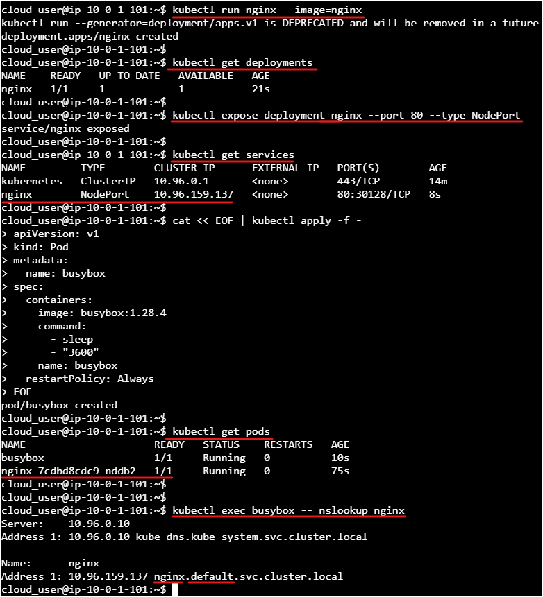

# Hizmet ve DNS 

Bir hizmet oluşturun ve bu hizmet için DNS adlarını çözün. Bu görevi tamamlamak için çalışan bir dağıtımınız, çalışan bir hizmetiniz ve hizmetin DNS adını Kubernetes kümenize kaydedebiliyor olmanız gerekir.

Bu, aşağıdaki görevleri gerçekleştireceğiniz anlamına gelir:
- En son nginx görüntüsünü kullanarak bir nginx dağıtımı oluşturun. 
- Dağıtımın başarıyla oluşturulduğunu doğrulayın. 
- Önceki adımda oluşturulan nginx dağıtımını bir hizmet yaratarak erişilebilir hale getirin
- Hizmetin başarıyla oluşturulduğunu doğrulayın. 
- DNS sorgusunu gerçekleştirmenize izin verecek bir POD oluşturun. 
- POD'un başarıyla oluşturulduğunu doğrulayın. 
- Daha önceki görevinizde oluşturduğunuz hizmete DNS sorgusu gerçekleştirin. 
- Hizmetin DNS adını kaydedin.


## ÇÖZÜM

### En son nginx görüntüsünü kullanarak bir nginx dağıtımı oluşturun. 

```shell
kubectl run nginx --image=nginx
```

### Dağıtımın başarıyla oluşturulduğunu doğrulayın. 

```shell
kubectl get deployments
```

### Önceki adımda oluşturulan nginx dağıtımını bir hizmet yaratarak erişilebilir hale getirin. 

```shell
kubectl expose deployment nginx --port 80 --type NodePort
```

### Hizmetin başarıyla oluşturulduğunu doğrulayın. 

```shell
kubectl get services
```

### DNS sorgusunu gerçekleştirmenize izin verecek bir POD oluşturun. 

```shell
cat << EOF | kubectl apply -f -
apiVersion: v1
kind: Pod
metadata:
  name: busybox
spec:
  containers:
  - image: busybox:1.28.4
    command:
      - sleep
      - "3600"
    name: busybox
  restartPolicy: Always
EOF
```

### POD'un başarıyla oluşturulduğunu doğrulayın. 

DNS sorgusuyla hizmete erişebildiğimizi görebilmek için POD oluşturuldu mu kontrol edelim:

```shell
kubectl get pods
```

### Daha önceki görevinizde oluşturduğunuz hizmete DNS sorgusu gerçekleştirin. 

Hizmetin adı nginx olduğuna göre isimden POD'a erişebiliyor muyuz diye bakalım:

```shell
kubectl exec busybox -- nslookup nginx
```

### Hizmetin DNS adını kaydedin

```shell
[service-name].default.svc.cluster.local
```

