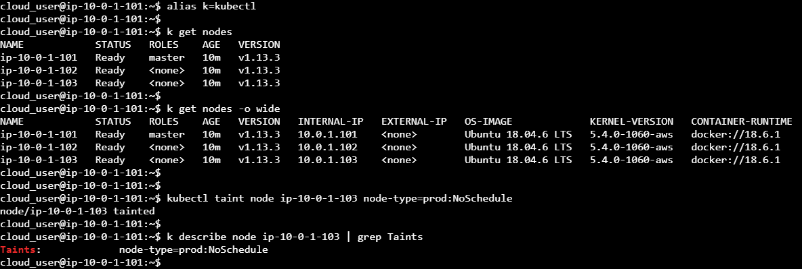
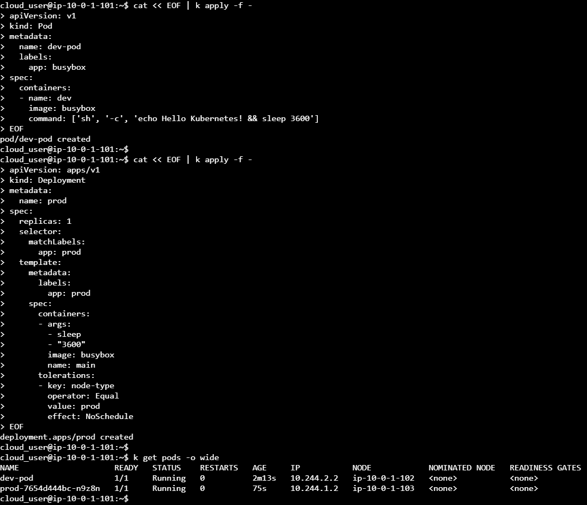
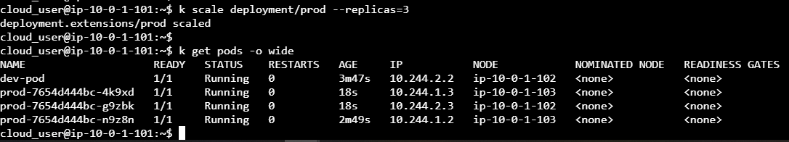

Bu görevde size üç düğümlü bir küme sunulacaktır. Bir ana düğüm (master node) ve diğer ikisi çalışan düğümlerdir (worker nodes). İki çalışan düğümlerden birini üretim (prod) ortamı, diğerini geliştirme (dev) ortamı olacak şekilde işaretlemelisiniz. Bu iki türü (prod ve dev) tanımlamanın amacı, geliştirme (dev) için kullandığınız çalışan düğüm yerine kazayla ürün (prod) düğümünü kullanmamın önüne geçmektir. Bunu başarmak için taints ve tolerations kullanacaksınız ve ardından iki POD yüklemesi yapacaksınız: Bir POD geliştirme ortamına, bir POD ürün ortamına yüklenecek. İki POD'un çalışır durumda olduğunu ve doğru ortamlarda bulunduğunu doğruladığınızda, bu görevi tamamlandığını düşünebilirsiniz.

Bu, aşağıdaki görevleri gerçekleştireceğiniz anlamına gelir:
- Düğümlerden birini node-type=prod:NoSchedule olarak işaretleyin
- dev Ortamında çalışacak şekilde bir POD'un YAML dosyasını tanımlayın
- prod Ortamında çalışacak şekilde bir diğer POD'un YAML dosyasını tanımlayın
- İki POD kendi tanımlarına uygun ortamlarda çalışacak şekilde ayaklandırılsın
- Her POD'un tanıma uygun olarak ilgili düğümlerde çalıştığını doğrulayın
- prod Ortamında çalışacak POD'un kopya sayısını arttırın ve tüm kopyaların ilgili ortamda çalıştığını doğrulayın

## ÇÖZÜM

### Düğümlerden birini node-type=prod:NoSchedule olarak işaretleyin

```shell
cloud_user@ip-10-0-1-101:~$ alias k=kubectl

cloud_user@ip-10-0-1-101:~$ k get nodes
NAME            STATUS   ROLES    AGE   VERSION
ip-10-0-1-101   Ready    master   10m   v1.13.3
ip-10-0-1-102   Ready    <none>   10m   v1.13.3  << dev Ortamı olsun
ip-10-0-1-103   Ready    <none>   10m   v1.13.3  << prod Ortamı olsun
```


```shell
cloud_user@ip-10-0-1-101:~$ kubectl taint node ip-10-0-1-103 node-type=prod:NoSchedule
node/ip-10-0-1-103 tainted

cloud_user@ip-10-0-1-101:~$ k describe node ip-10-0-1-103 | grep Taints
Taints:             node-type=prod:NoSchedule
```

### dev Ortamında çalışacak şekilde bir POD'un YAML dosyasını tanımlayın

dev Ortamında çalışacak şekilde bir YAML oluşturuyoruz. 

```shell
cloud_user@ip-10-0-1-101:~$ cat << EOF | k apply -f -
apiVersion: v1
kind: Pod
metadata:
  name: dev-pod
  labels:
    app: busybox
spec:
  containers:
  - name: dev
    image: busybox
    command: ['sh', '-c', 'echo Hello Kubernetes! && sleep 3600']
EOF
pod/dev-pod created
cloud_user@ip-10-0-1-101:~$
```

### prod Ortamında çalışacak şekilde bir diğer POD'un YAML dosyasını tanımlayın

Tolerations ile POD'un çalışmasını istediğimiz düğümün `node-type` anahtarının `prod` olmasını istediğimizi belirtiyoruz

```shell
cloud_user@ip-10-0-1-101:~$ cat << EOF | k apply -f -
apiVersion: apps/v1
kind: Deployment
metadata:
  name: prod
spec:
  replicas: 1
  selector:
    matchLabels:
      app: prod
  template:
    metadata:
      labels:
        app: prod
    spec:
      containers:
      - args:
        - sleep
        - "3600"
        image: busybox
        name: main
      tolerations:
      - key: node-type
        operator: Equal
        value: prod
        effect: NoSchedule
EOF
deployment.apps/prod created
cloud_user@ip-10-0-1-101:~$
```


### İki POD kendi tanımlarına uygun ortamlarda çalışacak şekilde ayaklandırılsın
Tüm POD'lar tanımlandığı sırada yaratıldıkları için bu adımda yapacak bir şey yok.
Eğer dosya olarak tanımlanmış ve ardından oluşturuluyor olsaydı:

```shell
k apply -f dev.yaml
k apply -f prod.yaml
```


### prod Ortamında çalışacak POD'un kopya sayısını arttırın ve tüm kopyaların ilgili ortamda çalıştığını doğrulayın

```shell
cloud_user@ip-10-0-1-101:~$ k scale deployment/prod --replicas=3
deployment.extensions/prod scaled
cloud_user@ip-10-0-1-101:~$
cloud_user@ip-10-0-1-101:~$ k get pods -o wide
NAME                    READY   STATUS    RESTARTS   AGE     IP           NODE            NOMINATED NODE   READINESS GATES
dev-pod                 1/1     Running   0          3m47s   10.244.2.2   ip-10-0-1-102   <none>           <none>
prod-7654d444bc-4k9xd   1/1     Running   0          18s     10.244.1.3   ip-10-0-1-103   <none>           <none>
prod-7654d444bc-g9zbk   1/1     Running   0          18s     10.244.2.3   ip-10-0-1-102   <none>           <none>
prod-7654d444bc-n9z8n   1/1     Running   0          2m49s   10.244.1.2   ip-10-0-1-103   <none>           <none>
```

### Her POD'un tanıma uygun olarak ilgili düğümlerde çalıştığını doğrulayın

```shell
cloud_user@ip-10-0-1-101:~$ k get pods -o wide
NAME                    READY   STATUS    RESTARTS   AGE     IP           NODE            NOMINATED NODE   READINESS GATES
dev-pod                 1/1     Running   0          2m13s   10.244.2.2   ip-10-0-1-102   <none>           <none>
prod-7654d444bc-n9z8n   1/1     Running   0          75s     10.244.1.2   ip-10-0-1-103   <none>           <none>
```







