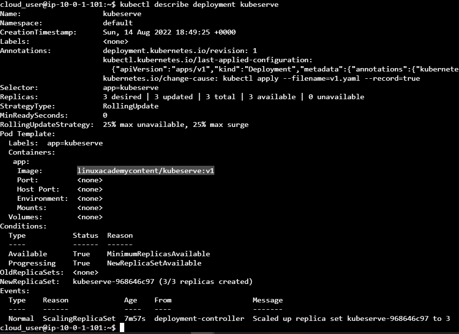
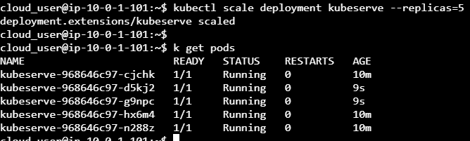

# Kesintisiz Güncelleme

Bir uygulamanız POD içinde çalışıyorken, uygulamanızın çalışan sürümünü yeni sürümüyle hiç kayıp olmaksızın yükseltmeniz bekleniyor. Uygulamanızın bir hizmetin arkasında çalışırken yeni sürümünüze yükseltmeniz sırasında kullanıcılar bir kesinti yaşamayacağından emin olmanız gerekiyor. Uygulamanızın ilk sürümü `linuxacademycontent/kubeserve:v1` ve ikinci sürümü `linuxacademycontent/kubeserve:v2` olacaktır. 


Bu, aşağıdaki görevleri gerçekleştireceğiniz anlamına gelir:
- Bir dağıtım oluşturun ve dağıtın ve dağıtımın başarılı olduğunu doğrulayın. 
- Uygulamanın doğru sürümü kullandığını doğrulayın. 
- Yüksek kullanılabilirlik oluşturmak için uygulamanızı ölçeklendirin. 
- Kullanıcıların uygulamanıza erişebilmesi için dağıtımınızın arkasında olduğu bir hizmet oluşturun. 
- Uygulamanın yeni sürümüne güncelleme yapın. 
- Uygulamanın şimdiki sürümünün 2. sürüm olduğunu ve son kullanıcılar için herhangi bir kesinti olmadığını doğrulayın.

## Bir dağıtım oluşturun ve dağıtın ve dağıtımın başarılı olduğunu doğrulayın. 

```shell
cat << EOF >> kubeserve-deployment-v1.yaml
apiVersion: apps/v1
kind: Deployment
metadata:
  name: kubeserve
spec:
  replicas: 3
  selector:
    matchLabels:
      app: kubeserve
  template:
    metadata:
      name: kubeserve
      labels:
        app: kubeserve
    spec:
      containers:
      - image: linuxacademycontent/kubeserve:v1
        name: app
EOF
```

`--record` İle bu dağıtımın imperative bir yollar (`k run`, `k set`, `k create` ... gibi) ile çalıştırdığımız komutların geçmişini görebilmemiz sağlanır [*](https://stackoverflow.com/a/62831794/104085).
Yükleyelim:

```shell
kubectl apply -f kubeserve-deployment-v1.yaml --record
```

## Uygulamanın doğru sürümü kullandığını doğrulayın. 

Aşağıdaki 2 yöntemle de durumunu görebiliriz:

```shell
cloud_user@ip-10-0-1-101:~$ kubectl rollout status deployments kubeserve
deployment "kubeserve" successfully rolled out
```

```shell
cloud_user@ip-10-0-1-101:~$ k rollout history deployment/kubeserve
deployment.extensions/kubeserve
REVISION  CHANGE-CAUSE
1         kubectl apply --filename=v1.yaml --record=true

```



## Yüksek kullanılabilirlik oluşturmak için uygulamanızı ölçeklendirin. 

```shell
kubectl scale deployment kubeserve --replicas=5
kubectl get pods
```




## Kullanıcıların uygulamanıza erişebilmesi için dağıtımınızın arkasında olduğu bir hizmet oluşturun. 

```shell
kubectl expose deployment kubeserve --port 80 --target-port 80 --type NodePort
kubectl get services
```


## Uygulamanın yeni sürümüne güncelleme yapın. 

Öncelikle sanki sürekli ziyaretçi geliyormuş gibi farklı bir konsolda döngü içinde curl istekleri atalım:

```shell
while true; do curl http://10.101.57.20; sleep 1; done
```


Diğer tarafta ise versiyonu güncellemek isteyelim:

```shell
kubectl set image deployments/kubeserve app=linuxacademycontent/kubeserve:v2 --v 6
```


Kesinti olmaksızın 2. sürüme geçildiği görülür:


## Uygulamanın şimdiki sürümünün 2. sürüm olduğunu ve son kullanıcılar için herhangi bir kesinti olmadığını doğrulayın.

```shell
kubectl get replicasets
kubectl get pods
```


```shell
kubectl rollout history deployment kubeserve
```


